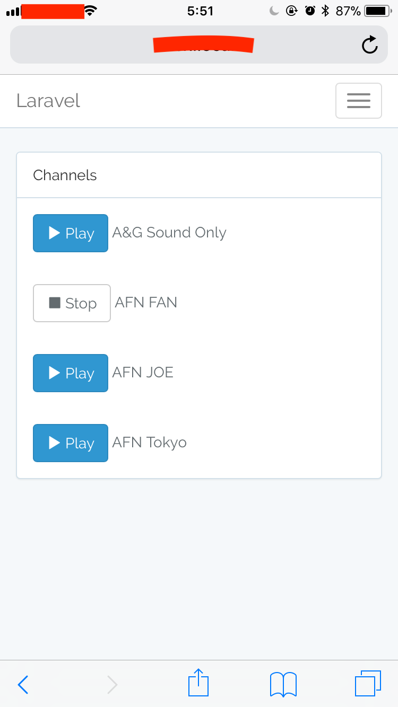

<p align="center"></p>

<p align="center">
<a href="https://travis-ci.org/laravel/framework"></a>
<a href="https://packagist.org/packages/laravel/framework"></a>
<a href="https://packagist.org/packages/laravel/framework"></a>
<a href="https://packagist.org/packages/laravel/framework"></a>
</p>

# Lararadio

Internet radio player which has a UI as web broweser on Raspberry Pi. So your smartphone or PC become remote controller like a following image.

# Screenshot



# PSR-2

```
composer require --dev squizlabs/php_codesniffer
```

phpcs.xml

```
<?xml version="1.0"?>
<ruleset name="Custom Standard">
    <rule ref="PSR2">
        <exclude name="Generic.Files.LineLength"/>
        <exclude name="PSR1.Classes.ClassDeclaration"/>
    </rule>

    <exclude-pattern>*.blade.php</exclude-pattern>
    <exclude-pattern>*.twig.php</exclude-pattern>
    <exclude-pattern>bootstrap/</exclude-pattern>
    <exclude-pattern>node_modules/</exclude-pattern>
    <exclude-pattern>public/build/</exclude-pattern>
    <exclude-pattern>public/css/</exclude-pattern>
    <exclude-pattern>public/js/</exclude-pattern>
    <exclude-pattern>public/vendor/</exclude-pattern>
    <exclude-pattern>resources/assets/</exclude-pattern>
    <exclude-pattern>resources/views/</exclude-pattern>
    <exclude-pattern>storage/</exclude-pattern>
    <exclude-pattern>vendor/</exclude-pattern>
</ruleset>
```

```
"phpcs.standard": "./phpcs.xml"
```

# License

MIT
